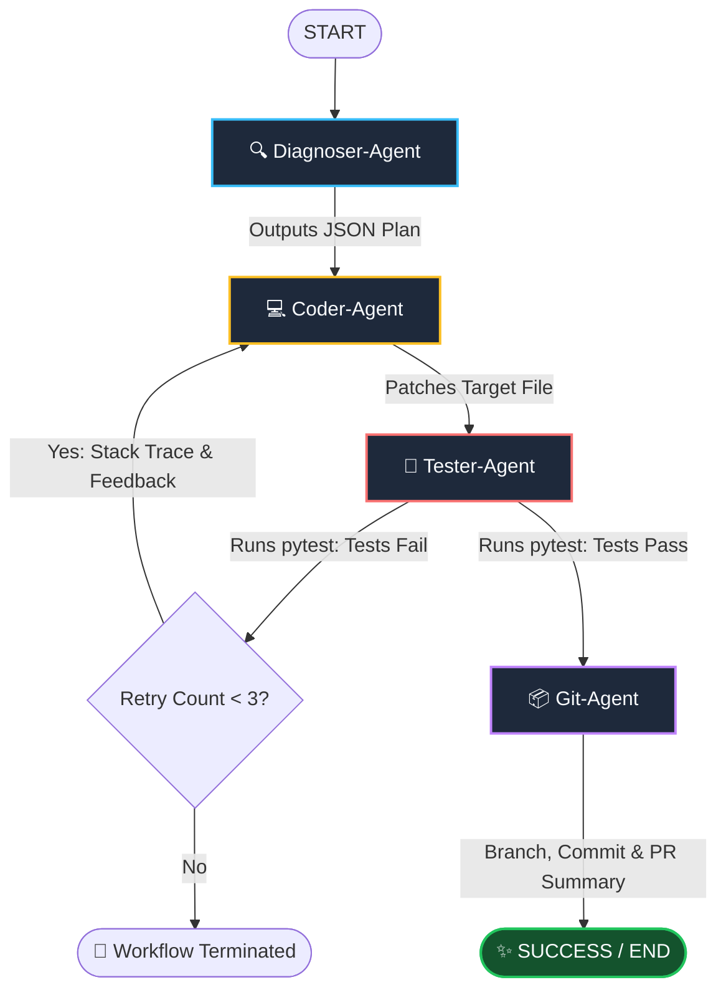

# 👻 GhostDev: Autonomous Multi-Agent Self-Healing Engine

[](https://www.python.org/)
[](https://github.com/langchain-ai/langgraph)
[](https://docs.pytest.org/)
[](https://gitpython.readthedocs.io/)

**GhostDev** is an autonomous multi-agent developer system built with **LangGraph**. It diagnoses software bugs from issue reports and repository files, refactors code, validates fixes through local unit test execution (`pytest`), self-corrects on failures, and automatically creates isolated Git branches and pull requests.

---

## 📺 Live Terminal Execution Recording

Below is the execution recording of GhostDev performing an autonomous diagnosis, candidate patch, test failure detection, self-correction loop, and Git release:

<p align="center">
  
</p>

---

## 🏗️ Multi-Agent Architecture

GhostDev connects four specialized agents via a LangGraph state graph with an automated feedback loop:



---

## 🤖 The Four Specialized Agents

| Agent | Role | Responsibility |
|---|---|---|
| **🔍 Diagnoser-Agent** | Principal Software Architect | Ingests issue reports and codebase files, identifies root causes, and creates a strict JSON resolution plan. |
| **💻 Coder-Agent** | Senior Full-Stack Engineer | Translates the fix plan and tester feedback into defensive, production-ready code patches. |
| **🧪 Tester-Agent** | QA Automation Specialist | Executes local unit tests (`pytest`), isolates failures/stack traces, and triggers the self-correction cycle. |
| **📦 Git-Agent** | DevOps Release Specialist | Automatically checks out an isolated fix branch (`fix/ghostdev-demo`), commits the patch, and formats a GitHub PR summary. |

---

## 📜 Full Terminal Execution Transcript

```text
============================================================
👻 GHOSTDEV: AUTONOMOUS MULTI-AGENT SELF-HEALING ENGINE
   [Mode: Local Simulation & Self-Correction Demonstration]
============================================================

🔍 [1/4] Diagnoser-Agent: Analyzing issue and codebase...
   📥 Ingested issue report: 'ZeroDivisionError in divide_numbers(a, b)'
   📂 Scanned target file: sample_app.py
   🎯 Target: sample_app.py
   💡 Root Cause: Function divide_numbers() performs raw division 'a / b' without validating if denominator 'b == 0', causing ZeroDivisionError.
   📋 Fix Plan: Add validation guard at start of divide_numbers: if b == 0, return None instead of raising ZeroDivisionError.

💻 [2/4] Coder-Agent: Implementing initial patch (Attempt 1)...
   ⚠️  [Simulation Note]: Writing candidate fix (mistakenly returning 0 instead of None to test feedback loop)...
   💾 Saved candidate code to sample_app.py

🧪 [3/4] Tester-Agent: Executing unit test suite (Attempt 1)...
   ❌ Tests FAILED: AssertionError in test_sample_app.py: expected None when b == 0, but received 0.
   📢 Triggering self-correction loop to Coder-Agent (Attempt 1/3)...

💻 [2/4] Coder-Agent: Self-correcting code based on Tester feedback (Attempt 2)...
   📥 Analyzing Tester-Agent feedback:
      -> Expected: None | Received: 0 (AssertionError: assert 0 is None)
   🛠️ Refining patch: Correcting return value to 'None' when b == 0...
   💾 Saved candidate code to sample_app.py

🧪 [3/4] Tester-Agent: Executing unit test suite (Attempt 2)...
   ✅ Tests PASSED: All 4 unit tests in test_sample_app.py passed successfully.
   🎯 Ready for git release.

📦 [4/4] Git-Agent: Managing version control and PR generation...
   🌿 Active branch: fix/ghostdev-demo
   📝 Committed changes: 'fix(sample_app): handle zero division gracefully'

============================================================
## 👻 GhostDev Auto-Fix Summary

- **Branch**: `fix/ghostdev-demo`
- **Target File**: `sample_app.py`
- **Root Cause**: Function divide_numbers() performs raw division 'a / b' without validating if denominator 'b == 0', causing ZeroDivisionError.
- **Applied Patch**: Add validation guard at start of divide_numbers: if b == 0, return None instead of raising ZeroDivisionError.
- **Verification**: All 4 unit tests in test_sample_app.py passed successfully. (Self-correction cycles: 1)
============================================================

🎉 GhostDev workflow execution completed.
✨ Successfully healed bug and pushed branch 'fix/ghostdev-demo'!
```

---

## 🚀 Quickstart & Setup

### 1. Install Dependencies
```bash
pip install -r requirements.txt
```

### 2. Configure Environment (`.env`)
GhostDev supports two operational modes:

- **Local Simulation Mode (Default & Offline)**:
  Runs out-of-the-box with zero API keys required. Demonstrates the complete multi-agent feedback loop locally.
  ```env
  SIMULATION_MODE=true
  ```

- **Live OpenAI Mode**:
  Connects to OpenAI's models (e.g. `gpt-4o`) for dynamic issue resolution:
  ```env
  SIMULATION_MODE=false
  OPENAI_API_KEY=sk-...
  OPENAI_MODEL_NAME=gpt-4o
  ```

### 3. Run the Engine
```bash
python main.py
```

The system will automatically initialize the git repository if needed, run the 4 agents in sequence, perform unit testing with `pytest`, self-correct on failures, and create the `fix/ghostdev-demo` branch.
